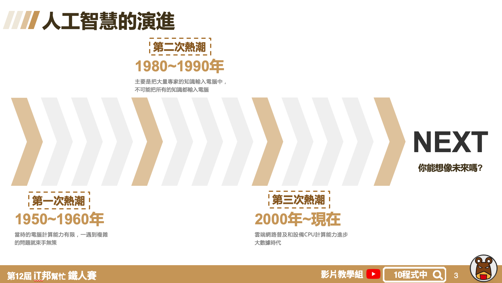

## Day 2 學習目標
- 人工智慧的演進
- 人工智慧的分級
- 機器是如何學習的

## 人工智慧的演進
AI 與機器學習技術正在蓬勃發展中，你能想像AI 人工智慧曾經被認為毫無出路嗎? 從人工智慧的時間軸來看可以分為三個熱潮。第一次熱潮（1950~1960年），由於早期的電腦硬體資源的不足導致複雜的問題無法輕易的解決。第二次熱潮（1980~1990年）將帶有知是本體的代理人放入機器人中使具有智慧，但人類資源有限不可能把所有的知識都輸入電腦。因此大家開始思考機器是否能夠讓他自己去學習？而不是人類一昧的餵入這些知識。第三次熱潮（2000年~現在）由於CPU、GPU以及雲端運算資源普及，早期複雜難解的演算法陸續可以透過超級電腦來解決。因此大家踏入了大數據以及深度學習的時代。

## 人工智慧的分級
人工智慧依照機器能夠處理與判斷的能力大致分為四級：
- 第一級人工智慧：自動控制
- 第二級人工智慧：探索推論、運用知識
- 第三級人工智慧：機器學習
- 第四級人工智慧：深度學習

## 機器如何學習？
監督式學習
- 給許多資料並給答案，透過損失函數計算來找出一個最佳解

非監督式學習
- 給許多資料不給答案，從資料中自己去找出關係，資料與資料間的相似程度與距離(分群演算法)

強化式學習
- 從環境中去學習，給獎賞和逞罰

本系列教學簡報 PDF & Code 都可以從我的 [GitHub](https://github.com/andy6804tw/2020-12th-ironman) 取得！