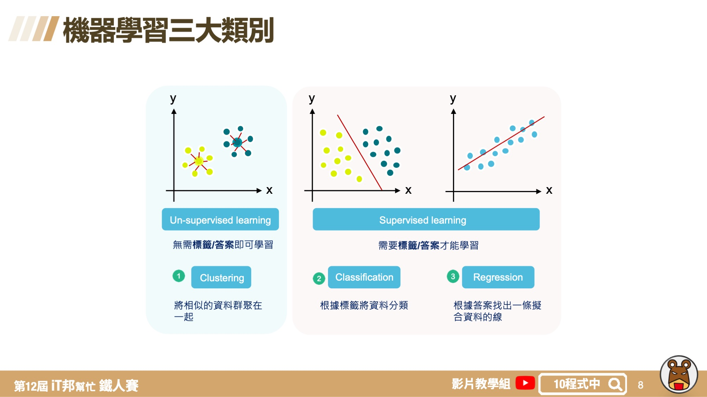
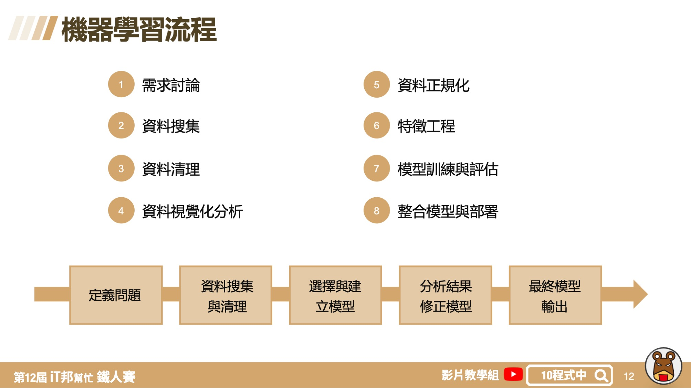

# 機器學習大補帖
## 今日學習目標
- 了解機器學習是什麼
- 機器學習三大類別
- 機器學習的流程

## 何謂機器學習?
機器學習是一種學習的演算法，是一種從一大群資料中去學習找出解決問題的方法。簡單來說你只要將大量的資料餵給電腦，機器學習的演算法會為你量身打造學習出一個特定的模型給你，而不是再透過人類手動的給予規則。透過一堆資料有標籤給答案，並從資料集學習與標記間的關聯，最後再從非特定資料去辨認答案。

## 機器學習三大類別

## 機器學習流程

本系列教學簡報 PDF & Code 都可以從我的 [GitHub](https://github.com/andy6804tw/2020-12th-ironman) 取得！